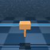

# DMC environment hacking
```python
import os
from pathlib import Path
import tempfile

import numpy as np
import dm_control
from dm_control.mujoco.wrapper import core
from dm_control.mujoco.wrapper.mjbindings import mjlib
import gym

import matplotlib.pyplot as plt
```
```python
env = gym.make('lcs:Paramcartpole-swingup-v1')
env.reset()
env.seed(42)
img = env.render('rgb_array')
```
## Model XML
```python
with tempfile.TemporaryDirectory() as tmp:
    fname = os.path.join(tmp, 'model.xml')
    core.save_last_parsed_model_to_xml(fname, check_model=env.unwrapped.env.physics.model)

    with open(fname, 'r') as f:
        xml = f.read()
```
```
<mujoco model="cart-pole">
  <compiler angle="radian" autolimits="true"/>
  <option timestep="0.01" integrator="RK4">
    <flag contact="disable" energy="enable"/>
  </option>
  <visual>
    <quality shadowsize="2048"/>
    <headlight ambient="0.4 0.4 0.4" diffuse="0.8 0.8 0.8" specular="0.1 0.1 0.1"/>
  </visual>
  <default/>
  <asset>
    <texture type="skybox" name="skybox" builtin="gradient" mark="random" rgb1="0.4 0.6 0.8" rgb2="0 0 0" markrgb="1 1 1" width="800" height="4800"/>
    <texture type="2d" name="grid" builtin="checker" mark="edge" rgb1="0.1 0.2 0.3" rgb2="0.2 0.3 0.4" markrgb="0.2 0.3 0.4" width="300" height="300"/>
    <material name="grid" texture="grid" texuniform="true" reflectance="0.2"/>
    <material name="self" rgba="0.7 0.5 0.3 1"/>
    <material name="self_default" rgba="0.7 0.5 0.3 1"/>
    <material name="self_highlight" rgba="0 0.5 0.3 1"/>
    <material name="effector" rgba="0.7 0.4 0.2 1"/>
    <material name="effector_default" rgba="0.7 0.4 0.2 1"/>
    <material name="effector_highlight" rgba="0 0.5 0.3 1"/>
    <material name="decoration" rgba="0.3 0.5 0.7 1"/>
    <material name="eye" rgba="0 0.2 1 1"/>
    <material name="target" rgba="0.6 0.3 0.3 1"/>
    <material name="target_default" rgba="0.6 0.3 0.3 1"/>
    <material name="target_highlight" rgba="0.6 0.3 0.3 0.4"/>
    <material name="site" rgba="0.5 0.5 0.5 0.3"/>
  </asset>
  <worldbody>
    <geom name="floor" size="4 4 0.2" pos="0 0 -0.05" type="plane" material="grid"/>
    <geom name="rail1" size="0.02 2" pos="0 0.07 1" quat="0.707107 0 0.707107 0" type="capsule" material="decoration"/>
    <geom name="rail2" size="0.02 2" pos="0 -0.07 1" quat="0.707107 0 0.707107 0" type="capsule" material="decoration"/>
    <camera name="fixed" pos="0 -4 1" quat="0.707107 0.707107 0 0"/>
    <camera name="lookatcart" target="cart" pos="0 -2 2" mode="targetbody"/>
    <light name="light" pos="0 0 6" dir="0 0 -1"/>
    <body name="cart" pos="0 0 1" gravcomp="0">
      <joint name="slider" pos="0 0 0" axis="1 0 0" type="slide" solreflimit="0.08 1" range="-1.8 1.8" damping="0.0005"/>
      <geom name="cart" size="0.2 0.15 0.1" type="box" mass="1" material="self"/>
      <body name="pole_1" pos="0 0 0" gravcomp="0">
        <joint name="hinge_1" pos="0 0 0" axis="0 1 0" damping="2e-06"/>
        <geom name="pole_1" size="0.045 0.5" pos="0 0 0.5" quat="0 1 0 0" type="capsule" mass="0.1" material="self"/>
      </body>
    </body>
  </worldbody>
  <actuator>
    <general name="slide" joint="slider" ctrlrange="-1 1" gear="10 0 0 0 0 0" actdim="0"/>
  </actuator>
</mujoco>

```

## Parameter hacking
```python
doc.print(env.unwrapped.env.physics.named.model.body_mass)
```

```
FieldIndexer(body_mass):
0  world [ 0       ]
1   cart [ 1       ]
2 pole_1 [ 0.1     ]
```
```python
env.reset(cart_mass=2.0, pole_mass=0.5)
doc.print(env.unwrapped.env.physics.named.model.body_mass)
```

```
FieldIndexer(body_mass):
0  world [ 0       ]
1   cart [ 2       ]
2 pole_1 [ 0.5     ]
```
```python
env.reset()
doc.print(env.unwrapped.env.physics.named.model.body_mass)
```

```
FieldIndexer(body_mass):
0  world [ 0       ]
1   cart [ 1       ]
2 pole_1 [ 0.1     ]
```
## Run simulation
```python
position_history = []
for _ in range(100):
    action = np.full(env.action_space.shape, 0.1)
    obs, reward, done, info = env.step(action)
    position_history.append(obs)

img = env.render('rgb_array', camera_id=1)
r.figure(img, f"{Path(__file__).stem}/cartpole_0.png", zoom="400%", title="Cartpole", caption="")

env.reset(pole_length=0.5, cart_mass=2.0)

img = env.render('rgb_array', camera_id=1)
r.figure(img, f"{Path(__file__).stem}/cartpole_1.png", zoom="400%", title="Cartpole", caption="")

for _ in range(100):
    action = np.full(env.action_space.shape, 0.1)
    obs, reward, done, info = env.step(action)
    position_history.append(obs)

position_history = np.stack(position_history)

# fig, axes = plt.subplots(nrows=2, ncols=3, figsize=(13, 9))

plt.figure(figsize=[13, 9])

pos_names = ['cart_position', 'pole_cos', 'pole_sin', 'cart_velocity', 'pole_velocity']
for i, pos_name in enumerate(pos_names):
    # plt.sca(axes[i // 3][i % 3])
    plt.subplot(3, 3, i + 1)
    plt.plot(np.arange(position_history.shape[0]), position_history[:, i])
    plt.xlabel('step')
    plt.ylabel(pos_name)
plt.tight_layout()
# plt.subplots_adjust(wspace=0.5)

r.savefig(f"{Path(__file__).stem}/position_history.png", title="position_history")
```

| **Cartpole** | **Cartpole** | **position_history** |
|:------------:|:------------:|:--------------------:|
|  |  |  |
|  |  |   |
