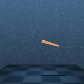

```python
env = gym.make('dmc:Acrobot-swingup-v1')
env.reset()
env.seed(42)
img = env.render('rgb_array')
doc.figure(img, f"{Path(__file__).stem}/cartpole.png", zoom="400%", title="Cartpole", caption="""
```

<table><tr><td rowspan="2"></td><td>Cartpole</td></tr><tr><td>
This is a dm_control environment called Cartpole.
    </td></tr></table>
