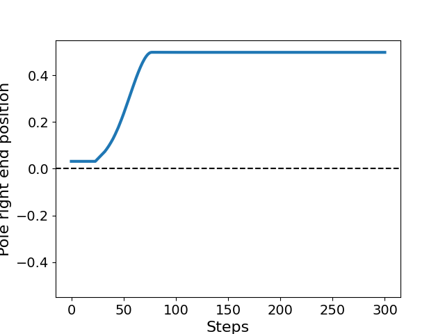
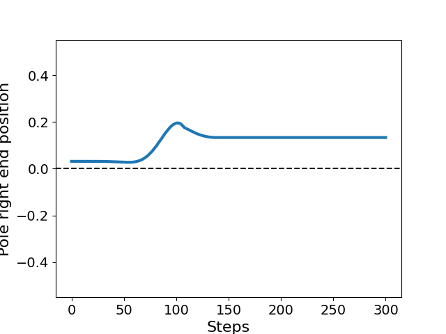
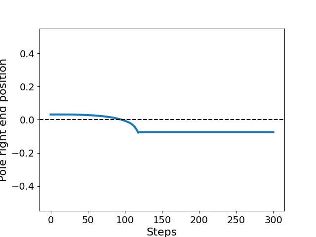
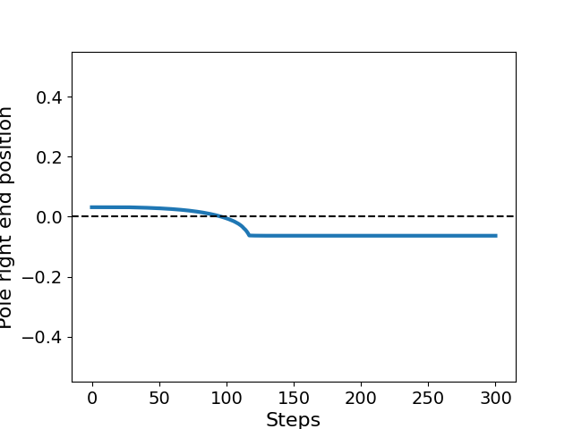

# Friction test
```python
env = gym.make('lcs:Frictiontest-run-v1')
obs = env.reset()
```
```python
def get_pos(env):
    half_length = 0.5
    com_xyz = env.unwrapped.env.physics.named.data.xipos['torso']
    cos_phi = env.unwrapped.env.physics.named.data.xmat['torso', 'xz']
    sin_phi = env.unwrapped.env.physics.named.data.xmat['torso', 'zz']
    x_min = com_xyz[0] + half_length * sin_phi
    return x_min
```
```python
table = doc.table()
img_size = 256
num_frames = 300

row = None
for i, sliding_friction in enumerate([0.001, 0.1, None, 2.0]):
    if i % 2 == 0:
        row = table.figure_row()
    positions = []
    frames = []

    if sliding_friction is not None:
        obs = env.reset(sliding_friction=sliding_friction)
    else:
        obs = env.reset()

    doc.print(f'Mujoco model frictions {env.unwrapped.env.physics.named.model.geom_friction["torso"]}')
    positions.append(get_pos(env))
    for _ in range(num_frames):
        action = np.zeros(env.action_space.shape)
        obs, reward, done, info = env.step(action)
        positions.append(get_pos(env))
        frames.append(env.render('rgb_array', width=img_size, height=img_size))

    frames = np.stack(frames)
    friction_str = 'default (1.0)' if sliding_friction is None else f'{sliding_friction:0.3f}'
    friction_fstr = 'default_1' if sliding_friction is None else str(sliding_friction).replace('.', '_')
    video_path = f'{Path(__file__).stem}/video_{friction_fstr}.mp4'
    imageio.mimsave(video_path, img_as_ubyte(frames), format='mp4', fps=24)


    plt.plot(positions, lw=3)
    plt.ylim(-0.55, 0.55)
    plt.axhline(0.0, color='black', linestyle='--')
    plt.xlabel('Steps', fontsize=16)
    plt.ylabel('Pole right end position', fontsize=16)
    plt.xticks(fontsize=14)
    plt.yticks(fontsize=14)
    row.savefig(f'{Path(__file__).stem}/plot_{friction_fstr}.png', title=f'sliding friction: {friction_str}')
```

| **sliding friction: 0.001** | **sliding friction: 0.100** |
|:---------------------------:|:---------------------------:|
|  |  |
| **sliding friction: default (1.0)** | **sliding friction: 2.000** |
|  |  |

```
Mujoco model frictions [0.001 0.1   0.1  ]
Mujoco model frictions [0.1 0.1 0.1]
Mujoco model frictions [1.  0.1 0.1]
Mujoco model frictions [2.  0.1 0.1]
```
```
sliding friction: 0.001
```


<video width="320" height="240" controls="true">
  <source src="frictiontest/video_0_001.mp4" type="video/mp4">
  Your browser does not support the video tag.
</video>


```
sliding friction: 0.100
```


<video width="320" height="240" controls="true">
  <source src="frictiontest/video_0_1.mp4" type="video/mp4">
  Your browser does not support the video tag.
</video>


```
sliding friction: default (1.0)
```


<video width="320" height="240" controls="true">
  <source src="frictiontest/video_default_1.mp4" type="video/mp4">
  Your browser does not support the video tag.
</video>


```
sliding friction: 2.000
```


<video width="320" height="240" controls="true">
  <source src="frictiontest/video_2_0.mp4" type="video/mp4">
  Your browser does not support the video tag.
</video>
