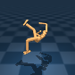

# DMC environment hacking
```python
import os
from pathlib import Path
import tempfile

import numpy as np
import dm_control
from dm_control.mujoco.wrapper import core
from dm_control.mujoco.wrapper.mjbindings import mjlib
import gym

import matplotlib.pyplot as plt
```
```python
env = gym.make('lcs:Humanoid_test-stand-v1')
env.reset()
env.seed(42)
img = env.render('rgb_array')
r = doc.table().figure_row()
r.figure(img, f"{Path(__file__).stem}/humanoid.png", zoom="400%", title="Humanoid", caption="")
```

| **Humanoid** |
|:------------:|
|  |
|  |
## Run simulation
```python
position_history = []
for _ in range(100):
    action = np.full(env.action_space.shape, 0.0)
    obs, reward, done, info = env.step(action)
    position_history.append(obs)
```

